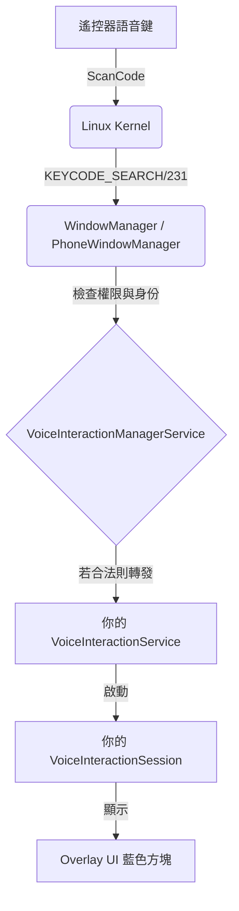

這是一份為你精心整理的 **Android TV 語音助手開發筆記**。這份筆記涵蓋了我們過去幾小時內在 Realtek 2819A 平台上實作的所有核心知識、程式碼邏輯以及系統架構。

---

# 🎙️ Android TV 自有語音助手開發實戰筆記 (Level 1)

## 一、 系統架構全視圖 (The Big Picture)

在 Android TV 中，語音助手不是一個普通 App，而是系統級服務。其訊號傳遞鏈如下：



### 關鍵知識點：
*   **身份驗證**：系統只信任住在 `/system` 或 `/system_ext` 分區，且具有 **Platform Signature** 的 App。
*   **按鍵分發**：`KEYCODE_VOICE_ASSIST` (231) 是觸發助手的標準按鍵。如果 App 身份不合法，系統會直接丟棄此按鍵。

---

## 二、 核心組件解析 (Code Explained)

我們在 `vendor/realtek/common/ATV/app/current/SimpleVoiceAssistant` 下建立了以下結構：

### 1. 服務宣告：`AndroidManifest.xml`
```xml
<!-- 使用系統 UID，讓 App 跑在 system 進程或擁有系統級權限 -->
<manifest ... android:sharedUserId="android.uid.system">
    
    <!-- 必須具備錄音與最上層顯示權限 -->
    <uses-permission android:name="android.permission.RECORD_AUDIO" />
    <uses-permission android:name="android.permission.SYSTEM_ALERT_WINDOW" />

    <application ...>
        <!-- 核心：宣告 VoiceInteractionService -->
        <!-- 必須要求 BIND_VOICE_INTERACTION 權限以確保安全 -->
        <service android:name=".MyVoiceInteractionService"
                 android:permission="android.permission.BIND_VOICE_INTERACTION"
                 android:exported="true">
            <meta-data android:name="android.voice_interaction"
                       android:resource="@xml/voice_interaction_service" />
            <intent-filter>
                <action android:name="android.service.voice.VoiceInteractionService" />
            </intent-filter>
        </service>
        
        <!-- 負責啟動 Session 的中繼服務 -->
        <service android:name=".MyVoiceInteractionSessionService"
                 android:permission="android.permission.BIND_VOICE_INTERACTION" />
    </application>
</manifest>
```

### 2. 組件連結：`res/xml/voice_interaction_service.xml`
這是「地圖」，告訴系統誰負責 UI，誰負責語音識別。
```xml
<voice-interaction-service 
    android:sessionService=".MyVoiceInteractionSessionService"
    android:supportsAssist="true"
    android:supportsLocalInteraction="true" />
```
*註：我們移除了 `recognitionService`，因為在 Hello World 階段尚未實作該 Java 類別，避免系統找不到類別而崩潰。*

### 3. Java 邏輯實作
*   **`MyVoiceInteractionService` (大腦)**: 常駐後台，監聽系統訊號。當 `onReady()` 被觸發，代表你已正式成為系統接管的助手。
*   **`MyVoiceInteractionSessionService`**: 單純的 Factory 類別，負責在需要時 `new` 出一個 Session。
*   **`MyVoiceInteractionSession` (臉部)**: 這是最重要的類別。
    *   `onCreateContentView()`: 定義你的 UI 佈局（如藍色方塊）。
    *   `onShow(Bundle args, int showFlags)`: **關鍵回呼**。當你按下遙控器語音鍵，系統會呼叫這個方法，這是你開始錄音的地方。

---

## 三、 編譯與系統整合 (Build Logic)

### 1. `Android.bp` 的深度含義
```go
android_app {
    name: "SimpleVoiceAssistant",
    platform_apis: true,        // 允許使用隱藏的 System API
    certificate: "platform",    // 使用系統金鑰簽名，獲得 uid 1000 權限
    system_ext_specific: true,  // 強制編譯進 system_ext 分區
    privileged: true,           // 宣告為特權 App
    static_libs: [
        "androidx.leanback_leanback", // TV 專用 UI 庫
        "rtk-framework",             // Realtek 平台專用庫
    ],
}
```

### 2. 為什麼 `pm install` 會失敗？
*   **權限拒絕 (`SecurityException`)**: 語音助手涉及隱私，Android 要求執行者必須擁有 `ACCESS_VOICE_INTERACTION_SERVICE`。
*   這個權限是 **Signature 級別**。當你用 `pm install` 把 App 裝在 `/data/app` 時，系統視其為「第三方 App」，拒絕賦予高階權限，導致進程無法啟動。
*   **解決方案**：必須透過修改產品的 `.mk` 檔案 (如 `PRODUCT_PACKAGES += SimpleVoiceAssistant`)，將其編譯入 System Image，使其成為「原生組件」。

---

## 四、 常用 Debug 指令工具箱 (Swiss Army Knife)

這是在 RTK Console 上生存的必備指令：

### 1. 狀態查詢
*   `dumpsys voiceinteraction`: 查看目前系統綁定了哪個助手、`mBound` 是否為 `true`、APK 路徑 (`sourceDir`) 在哪。
*   `settings get secure voice_interaction_service`: 確認目前設定的助手組件名稱。

### 2. 強制啟動與測試
*   `settings put secure voice_interaction_service com.example.simplevoiceassistant/.MyVoiceInteractionService`: 強制切換助手。
*   **`input keyevent 231`**: 模擬遙控器語音鍵。
*   **`cmd voiceinteraction show`**: 繞過按鍵，直接命令系統彈出助手 UI。

### 3. 日誌追蹤
*   `logcat -c`: 清除快取。
*   `logcat -s SimpleAssistant SimpleAssistantSession VoiceInteractionManagerService`: 只看助手相關日誌。
*   `logcat -v tag -s WindowManager | grep interceptKey`: 觀察按鍵是否被系統攔截。

---

## 五、 下一個階段預告：Level 2 語音處理

當你的藍色方塊成功彈出後，我們將進階到：
1.  **音訊奪取 (Audio Focus)**：當助手出現，電視音量要自動降低 (Ducking)。
2.  **錄音流水線 (Audio Pipeline)**：
    *   使用 `AudioRecord` 從 `VOICE_RECOGNITION` 來源讀取 16bit/16kHz PCM 數據。
3.  **語音轉文字 (STT)**：
    *   將 PCM 數據透過網路送往 Google/OpenAI API 或本地 TinyML 模型。
4.  **視覺反饋**：
    *   實作波形動畫，讓使用者知道助手正在聽。

---

**架構師心法：**
在 Android 系統開發中，**「身份 (Identity)」** 決定一切。不要試圖用開發手機 App 的思維來應對 TV 系統組件。當系統不理你時，通常不是程式碼寫錯，而是你的 App 身份（分區、簽名、權限）不被系統認可。

待燒錄完成，一旦身份合法，你之前的努力將會瞬間開花結果。