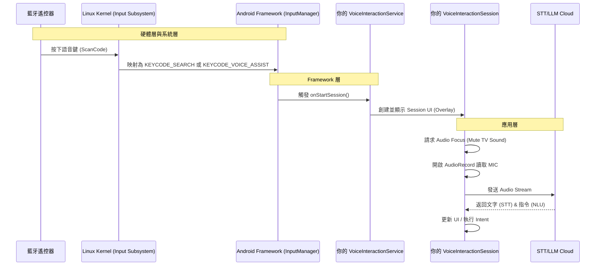

你好！作為一位在 Android TV 領域打滾多年的架構師，很高興看到你投入這個領域。Realtek (RTK) 的方案（如 RTD2851A/RTD2841 等系列）在運營商機上非常常見，使用 AOSP 環境來練習是最硬核但也最能學到東西的路徑。

在開始寫 Code 之前，我們必須先建立正確的**系統觀（System View）**。Android 的語音助手不是一個普通的 App，它是 Android Framework 中的一個特殊公民。

以下是你必須先理解的核心知識架構，我們分層次來講：

---

### 一、 核心架構：Android Voice Interaction Framework

不要嘗試用普通的 `Service` 或 `Activity` 來做語音助手，那是野路子，會遇到 Audio Focus 搶佔失敗、UI 無法覆蓋、無法被遙控器喚醒等問題。

Android 提供了一套標準框架：**`VoiceInteractionService` (VIS)**。

#### 1. 關鍵組件 (The Holy Trinity)

| 組件名稱 | 繼承類別 | 職責 |
| :--- | :--- | :--- |
| **Manager Service** | `VoiceInteractionService` | **大腦**。常駐後台的系統服務。負責與系統綁定，監聽喚醒事件（Hotword 或 按鍵），並管理 Session 的生命週期。 |
| **Interactive UI** | `VoiceInteractionSession` | **手腳與臉**。這是 UI 層。當助手被喚醒時，Session 會被創建並顯示在所有視窗的**最上層 (Overlay)**。錄音、STT 識別、TTS 發話、UI 動畫都在這裡處理。 |
| **Detector** | `RecognitionService` | **耳朵**（可選）。主要用於 Always-on Hotword (如 "Hey Google")。但在 TV 遙控器場景（Push-to-Talk），我們通常直接在 Session 裡開啟 `AudioRecord`，這塊可以暫緩。 |

#### 2. 訊號流向圖 (Signal Flow)

這是你在 RTK 平台上會看到的訊號流，理解這個非常重要：



---

### 二、 RTK AOSP 平台的特殊注意事項

既然你在 RTK 平台上開發，有幾個坑和特性是你必須知道的（這些是 Google 官方文檔不會告訴你的）：

#### 1. 遙控器按鍵映射 (Key Layout)
RTK 的公版遙控器或客戶定製遙控器，按下麥克風鍵時，底層送出的 ScanCode 必須正確映射到 Android KeyCode。
*   **檔案位置**：通常在 `/system/usr/keylayout/` 下的 `.kl` 檔案（如 `Vendor_xxxx_Product_xxxx.kl`）。
*   **關鍵 KeyCode**：
    *   `KEYCODE_SEARCH` (常見於舊版)
    *   `KEYCODE_VOICE_ASSIST` (標準 Android TV 規範)
    *   `KEYCODE_ASSIST`
*   **任務**：你需要確認按下遙控器時，`adb shell getevent -l` 吐出的是什麼，以及系統是否將其攔截並轉發給你的 VIS。

#### 2. 音頻通道 (Audio Input Source)
Android TV 遙控器的麥克風音頻通常是透過藍牙 (SCO 或 HID with Voice over BLE) 傳輸的。
*   **Audio Source**：寫 Code 時，`MediaRecorder.AudioSource.VOICE_RECOGNITION` 是標準，但在某些 RTK 韌體上，可能需要用 `MIC` 或特定的配置才能抓到藍牙遙控器的聲音。
*   **虛擬聲卡**：RTK 底層通常會把藍牙遙控器的音頻掛載為一個虛擬的 Audio Input Device。

#### 3. 系統簽名 (System Privileges)
雖然 VIS 不需要 System Signature 也能跑，但如果要執行一些進階功能（如強制停止其他 App、直接注入按鍵事件、修改系統設定），擁有系統簽名（Platform Signature）會方便很多。在 AOSP 編譯環境下，將你的 App 放入 `/packages/apps/` 並賦予 `platform` 簽名是常規操作。

---

### 三、 實作前的準備：Manifest 宣告

這是最容易勸退新手的地方。你的 App 必須宣告自己是一個 `VoiceInteractionService`。

**AndroidManifest.xml 關鍵片段：**

```xml
<manifest ...>
    <!-- 錄音權限 -->
    <uses-permission android:name="android.permission.RECORD_AUDIO" />
    
    <application ...>
        <!-- 核心服務 -->
        <service android:name=".MyVoiceInteractionService"
                 android:permission="android.permission.BIND_VOICE_INTERACTION"
                 android:exported="true">
            <meta-data android:name="android.voice_interaction"
                       android:resource="@xml/voice_interaction_service" />
            <intent-filter>
                <action android:name="android.service.voice.VoiceInteractionService" />
            </intent-filter>
        </service>
    </application>
</manifest>
```

**res/xml/voice_interaction_service.xml:**
這個檔案定義了你的 Session 和識別服務是誰。

```xml
<voice-interaction-service xmlns:android="http://schemas.android.com/apk/res/android"
    android:sessionService=".MyVoiceInteractionSessionService"
    android:recognitionService=".MyRecognitionService" 
    android:settingsActivity=".SettingsActivity"
    android:supportsAssist="true"
    android:supportsLocalInteraction="true" />
```
*(注意：`MyVoiceInteractionSessionService` 是一個用來啟動 Session 的輕量級 Service)*

---

### 四、 你的練習路徑 (Roadmap)

建議你按照以下步驟在 RTK2851A 上進行練習：

1.  **Level 1: 環境建置與 Hello World**
    *   建立一個空的 Android Project。
    *   寫好 Manifest 和 XML 配置。
    *   實作最簡單的 `VoiceInteractionService` 和 `VoiceInteractionSession`。
    *   **目標**：透過 `adb shell settings put secure voice_interaction_service <你的package/你的Service>` 設定為預設助手。
    *   **驗證**：按下遙控器語音鍵，看到螢幕下方出現一個空白的 Overlay View（Logcat 顯示 Session `onCreate`, `onShow`）。

2.  **Level 2: 處理 Audio Focus 與 UI**
    *   在 Session 的 `onShow` 中請求 Audio Focus (讓背景影片暫停或變小聲)。
    *   繪製一個簡單的波形動畫 View。
    *   在 `onHide` 放棄 Audio Focus。

3.  **Level 3: 錄製音頻 (AudioRecord)**
    *   在 Session 中開啟 `AudioRecord`。
    *   將錄到的 PCM 數據存成 WAV 檔到本地儲存。
    *   **驗證**：把檔案 `adb pull` 出來，確認有錄到遙控器的聲音。

4.  **Level 4: 對接 STT (Speech-to-Text)**
    *   這時才考慮串接 Google Speech API, Azure, 或 OpenAI Whisper (API)。
    *   將 PCM 串流送到雲端，拿回文字。

---

### 五、 給架構師的 Debug 錦囊

在 RTK AOSP 上開發，你會經常用到以下指令：

1.  **查看當前語音助手是誰：**
    ```bash
    adb shell settings get secure voice_interaction_service
    ```
2.  **切換語音助手 (無需 UI 操作)：**
    ```bash
    adb shell settings put secure voice_interaction_service com.example.assistant/.MyService
    ```
3.  **監控按鍵事件 (確認遙控器是否活著)：**
    ```bash
    adb shell getevent -l
    ```
4.  **查看 Audio 狀態 (確認 Audio Focus 和 Input Source)：**
    ```bash
    adb shell dumpsys audio
    ```

### 總結

現在你不需要擔心 AI 模型或自然語言處理，首要任務是**「打通管道」**。
在 Android Framework 中，讓按下遙控器 -> 觸發你的 Code -> 彈出 UI -> 拿到麥克風權限，這條路通了，後面接 ChatGPT 還是 Google Assistant SDK 都是小事。

準備好開始寫 Level 1 的 Code 了嗎？如果準備好了，我可以提供 Boilerplate Code 給你。